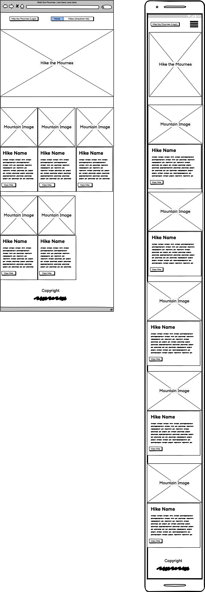
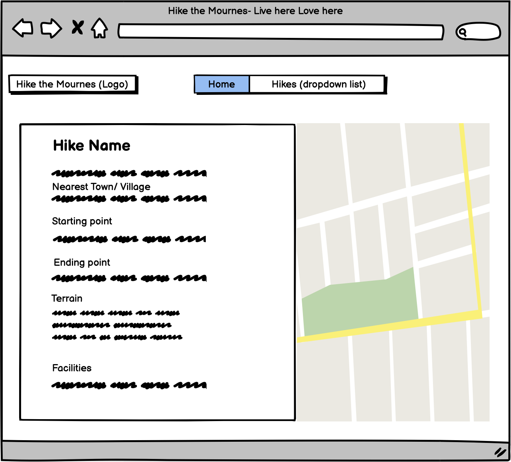
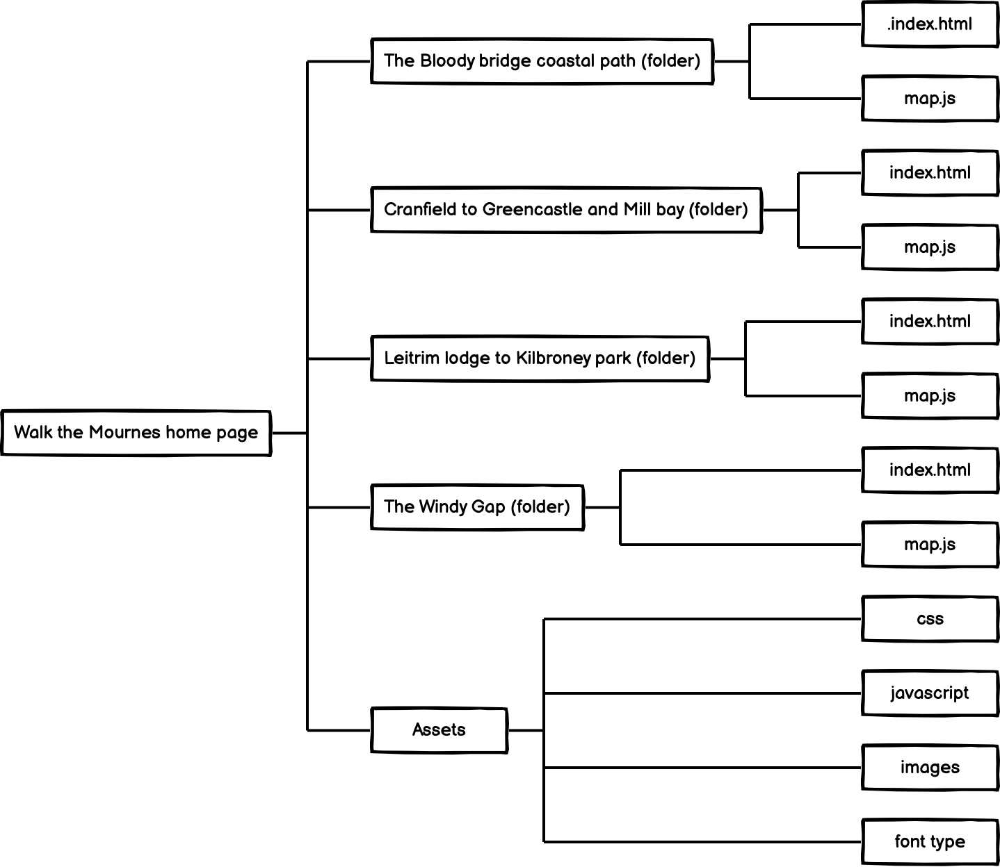

# Walk the Mournes
===========================

 The concept of this website is to provide a base for tourists and locals to search hiking trails in the Mourne Mountains.  With the relevant hiking information, all in one place.  It is to be an extension to the existing official tourism site for the Mourne Mountains in County Down [Visit Mourne](https://www.visitmournemountains.co.uk/) which has already got a large amount of traffic using the site and so linking up with them would be ideal.  

------
## User Experience (UX)
-------
   #### User stories
  As a First Time Visitor I want to...
Understand the purpose of the site within the first couple of minutes of entering it.
Easily access walking trails without having to search the site to find more information.  Find material on the following information:
  *	Name of walk
 *	Length of walk
 *	Grade - Easy, Moderate or Strenuous
 *	Advice on the type of walk
 *	Image of the trail
*	Navigate the website effortlessly, with clear menu items, definite and engaging call to action buttons.
####    As a Returning Visitor I want to...
  * See that the walks and hikes that I enjoyed are in the same place so that I can easily find them upon returning.
* Find any new trails added to the site.
 
####    As a Frequent User I want to...
   * See if there are any new Walks added to the website with more advice walking the trail.
* Have the information layout to be consistent so that I can rely on the info that I find useful to be easily accessible.
  * Find any new data added to the site to be consistent and changes to be gradual so that I can still navigate through the site and slowly get used to any changes.

--------- 
## Design
----
#### Colour Scheme
The two main colours used are:
* Maroon - #7f0263 #806 hsl (313,96%,25%) rgb (127,2,99)
* White - #ffffff #fff white hsl (0,0%,100%) rgb (255,255,255)
* As seen on the (https://www.visitmournemountains.co.uk/) 
#### Typography
H1 Titles
* font-family: james-stroker-font;
* font-size: 80px;
* color: #ffffff;
* text-align: center;
------
## Wireframes
----
*  !Home Wireframe &  Mobile Wireframe 
* Hike Details Wireframe - 
* Site Map - 
---- 
## Features
----
#### Existing Features
* Responsive on all device sizes
Interactive elements
#### Features to be implemented in the future:
Reviews and advice from those who have done the trail.
More Hiking trails.
Accommodation links
Links to relevant hiking clubs in and around the area.
Ability to send the trail map to the user’s phone.
 
---- 
## Technologies Used
----
### Frameworks, Libraries & Programs Used
- Bootstrap 4.4.1:
-   Bootstrap was used to assist with the responsiveness and styling of the website.
- Font Awesome:
- Font Awesome was used on all pages throughout the website to add icons for aesthetic and UX purposes.
- Git
- Git was used for version control by utilizing the Gitpod terminal to commit to Git and Push to GitHub.
 - GitHub:
- GitHub is used to store the project's code after being pushed from Git.
- Balsamiq:
- Balsamiq was used to create the wireframes during the design process.
 
#### Languages Used
- HTML5
- CSS3
- JavaScript
----
## Technologies Used
----
#### Frameworks, Libraries & Programs Used
- Bootstrap 4.4.1:
- Bootstrap was used to assist with the responsiveness and styling of the website.
- Font Awesome:
- Font Awesome was used on all pages throughout the website to add icons for aesthetic and UX purposes.
- Git
- Git was used for version control by utilizing the Gitpod terminal to commit to Git and Push to GitHub.
- GitHub:
- GitHub is used to store the project's code after being pushed from Git.
- Balsamiq:
- Balsamiq was used to create the wireframes during the design process.

----
## Testing
----
- The W3C Markup Validator and W3C CSS Validator Services were used to validate every page of the project to ensure there were no syntax errors in the project.
- W3C Markup Validator - Results
- W3C CSS Validator - Results
### Testing
#### Major Bugs fixed
- __Bug-__ The map for ‘Leitrim Lodge Car Park to Kilbroney Car Park’ hike had a major bug that wouldn’t show all of the coordinates only the starting point.  __Solution -__  A missing comma on Yellow Water picnic site.
- __Bug-__ The Hero image wouldn’t respond to the CSS styling to span across the viewfinder. __Solution-__ Change the section tag to a div, as Bootstrap prefers divs, add a container-fluid class and delete the container class.
----
## Deployment
----
#### GitHub Pages
The project was deployed to GitHub Pages using the following steps...
- Log in to GitHub and locate the [GitHub Repository](https://github.com/)
-At the top of the Repository (not top of page), locate the "Settings" Button on the menu.
- Alternatively Click Here for a GIF demonstrating the process starting from Step 2.
- Scroll down the Settings page until you locate the "GitHub Pages" Section.
- Under "Source", click the dropdown called "None" and select "Master Branch".
- The page will automatically refresh.
- Scroll back down through the page to locate the now published site link in the "GitHub Pages" section.

#### Forking the GitHub Repository
- By forking the GitHub Repository we make a copy of the original repository on our GitHub account to view and/or make changes without affecting the original repository by using the following steps...
- Log in to GitHub and locate the [GitHub Repository](https://github.com/)
- At the top of the Repository (not top of page) just above the "Settings" Button on the menu, locate the "Fork" Button.
- You should now have a copy of the original repository in your GitHub account.

#### Making a Local Clone
- Log in to GitHub and locate the [GitHub Repository](https://gith
- Under the repository name, click "Clone or download".
- To clone the repository using HTTPS, under "Clone with HTTPS", copy the link.
- Open Git Bash
- Change the current working directory to the location where you want the cloned directory to be made.
- Type git clone, and then paste the URL you copied in Step 3.
- $ git clone https://github.com/YOUR-USERNAME/YOUR-REPOSITORY

- Press Enter. Your local clone will be created.
- $ git clone https://github.com/YOUR-USERNAME/YOUR-REPOSITORY
-  Cloning into `CI-Clone`...
- remote: Counting objects: 10, done.
- remote: Compressing objects: 100% (8/8), done.
- remove: Total 10 (delta 1), reused 10 (delta 1)
- Unpacking objects: 100% (10/10), done.

Click Here to retrieve pictures for some of the buttons and more detailed explanations of the above process.

## Deployment
When creating the code the process of regular updates to the repository is needed, which is completed in the Command line Interface below are the steps taken to do so:
1. Enter git add (Enter the web page to be updated)
2. Git commit -m “Reason for edit”
3. Git push
 
4. To deploy this website project from Github repository to Github Pages the following steps were taken:
5. Log into Github
6. Search Github repositories for milestone_one_project and click
7. On the Menu below the title reading [emurphy7233/Milestone_project_two](https://github.com/emurphy7233) click the settings.
8. Scroll down to Github Pages.
9. Under Source click the drop-down menu and select Master.
10. Once this is done the page is refreshed and the website is deployed.
11. Scroll back to Github pages to retrieve the deployed URL.
 
At the time of deployment, the development version and the deployed version are both identical.

----
## Credits
---- 
#### Code
(https://preview.colorlib.com/theme/bootstrap/website-menu-03/) Navbar and layout of hero image.
https://jsfiddle.net/f6s9pczt/ Map
Bootstrap stylesheet link, jquery & CDN referenced in the header on each page.
Font Awesome stylesheet link referenced in the header on each page.

#### Content
5 Mourne Mountain hikes referenced from visit mourne mountains pamphlets. 
JavaScript content was referenced from here (https://jsfiddle.net/f6s9pczt/).

#### Layout Inspiration
Inspiration for the layout (https://walkni.com/mourne-mountains-destination/).
Layout of the Map (https://www.aldi.ie/store-finder/?q=leixlip&address=Leixlip%2C%20Co.%20Kildare&latitude=53.36384280000001&longitude=-6.4900033) 
#### Media The photos used in this site were obtained from …
All Images on Home page by Steven Hylands from (https://www.pexels.com/@shylands)
Font Awesome for the icons (https://fontawesome.com/) 
 
#### Acknowledgements
(https://www.skyscanner.net/) SkyScanner
(http://www.mournelive.com/) Mourne live
(https://www.visitmournemountains.co.uk/) Visit Mourne Mountains- Official tourism website for visit Mourne.
(https://www.kayak.co.uk/horizon/sem/hotels/general?lang=en&skipapp=true&destination=c601&kw=-1&gclid=CjwKCAjwhMmEBhBwEiwAXwFoEQTovsfgAwJfb4NcpTkplaZL-lt6SYyimxJPQUuzeR-IQLn0YKteGBoCq8kQAvD_BwE&aid=104550127802)  KAYAK
(https://www.nationaltrust.org.uk/the-mournes)   National Trust-  The Mournes
